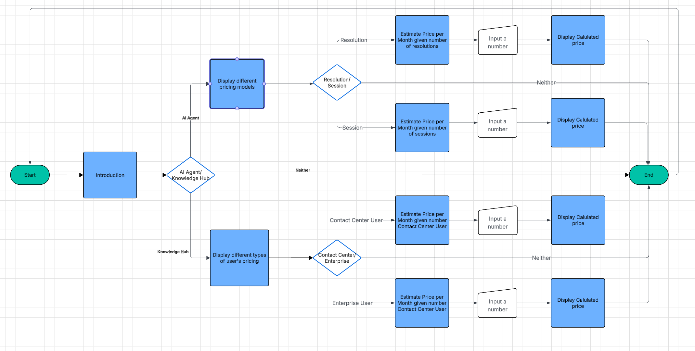
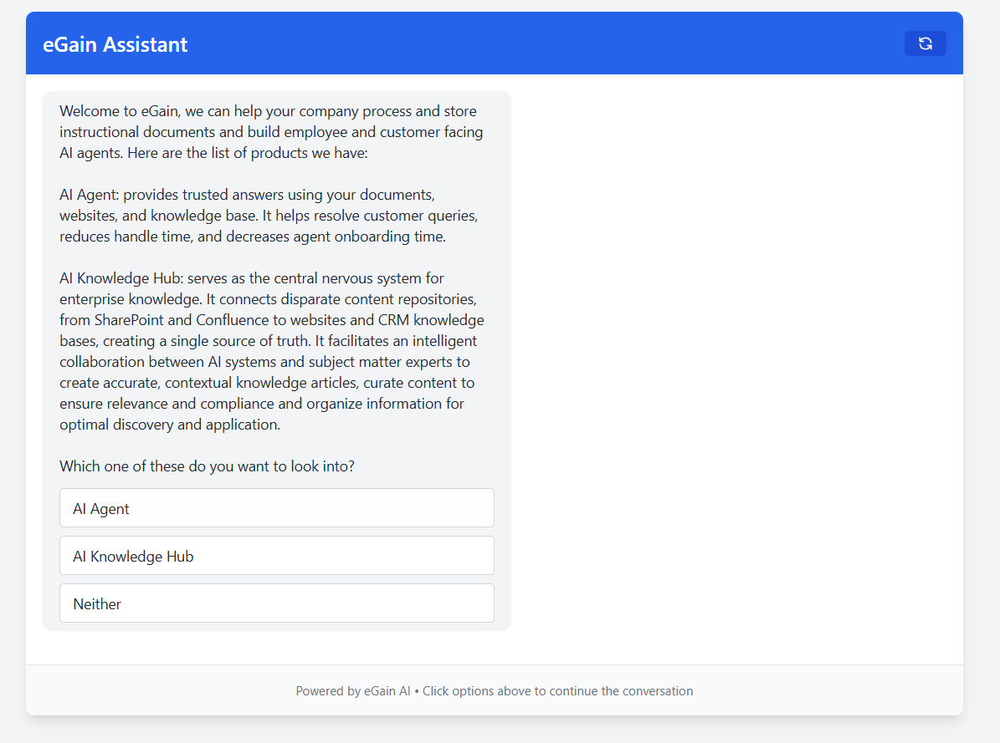
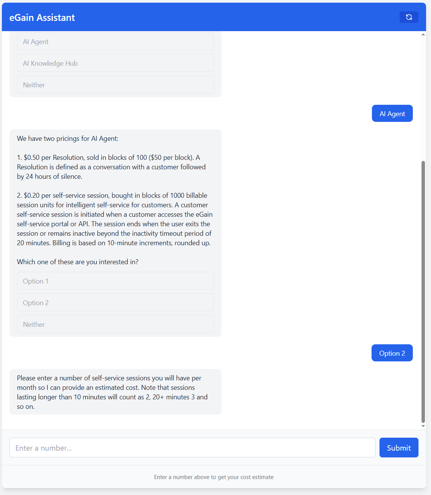
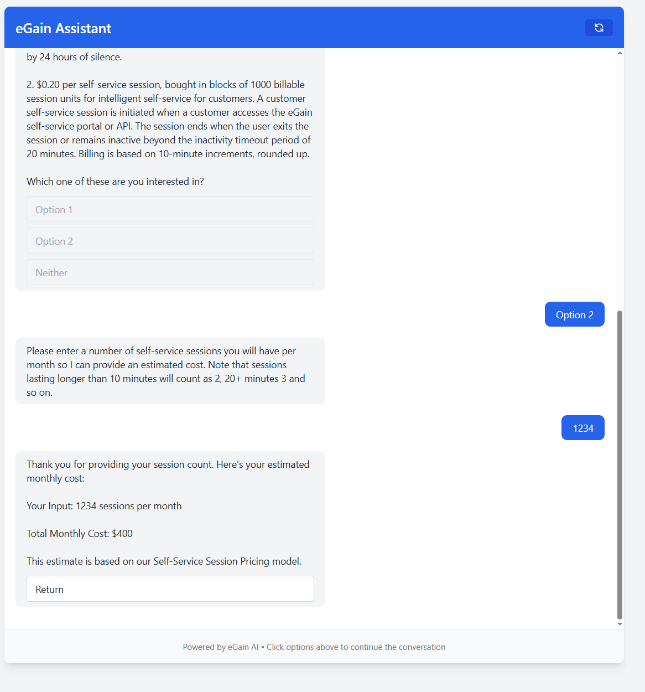

# eGain Assignment - Next.js App

A modern Next.js 15+ application with TypeScript, Tailwind CSS, authentication, and database integration.

## Screenshots






## Introduction

I'm thinking about a creative way to to this project, and I thought about why not just use eGain's products and guiding a customer to choose the right product? I tried out eGain's AI Agent for some inspiration.

I asked it about eGain's products, and it could only provide me with two products: AI Agent and AI Knowledge Hub, so after gathering some more details about the products and their pricing model I decided to implement them into my chatbot project.

I designed the decision tree and implemented in Cursor. It helped greatly setting up a basic project so I can just add my modifications.
I add the input number step so there is potential human input instead of just selection. And there is a way to show error management.

## Prerequisites

Before running this application, make sure you have the following installed:

- **Node.js 20+** - [Download from nodejs.org](https://nodejs.org/)
- **npm** (comes with Node.js)

### Installing Node.js

1. Visit [nodejs.org](https://nodejs.org/)
2. Download the LTS version (recommended for most users)
3. Run the installer and follow the setup wizard
4. Verify installation by opening a terminal and running:
   ```bash
   node --version
   npm --version
   ```

## Quick Start

### 1. Install Dependencies
```bash
npm install
```

### 2. Start Development Server
```bash
npm run dev
```

### 3. Open Your Browser
Visit [http://localhost:3000](http://localhost:3000)

## That's It! 🎉

Your Next.js application is now running locally. The app includes:

- ⚡ **Next.js 15+** with App Router
- 🔥 **TypeScript** for type safety
- 💎 **Tailwind CSS** for styling
- 🔒 **Authentication** with Clerk
- 📦 **Database** with DrizzleORM (PGlite for local development)
- 🌐 **Multi-language** support

## Available Commands

| Command | Description |
|---------|-------------|
| `npm run dev` | Start development server |
| `npm run build` | Build for production |
| `npm run start` | Start production server |
| `npm run test` | Run tests |
## Troubleshooting

**Port 3000 already in use?**
```bash
npx kill-port 3000
```
## Next.js Version

This project uses **Next.js 15.1.0** with the App Router. Make sure you have Node.js 20+ for optimal compatibility.

---
